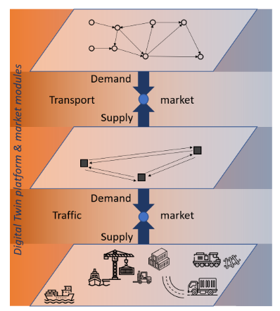

# 日期

## 2023.9.13

# 论文标题

## [Digital Twins for Ports: Derived From Smart City and Supply Chain Twinning Experience](https://ieeexplore.ieee.org/search/searchresult.jsp?newsearch=true&queryText=Digital%20Twins%20for%20Ports:%20Derived%20From%20Smart%20City%20and%20Supply%20Chain%20Twinning%20Experience)

# 摘要

Ports are striving for innovative technological solutions to cope with the ever-increasing growth of transport, while at the same time improving their environmental footprint. An emerging technology that has the potential to substantially increase the efficiency of the multifaceted and interconnected port processes is the digital twin. Although digital twins have been successfully integrated in many industries, there is still a lack of cross-domain understanding of what constitutes a digital twin. Furthermore, the implementation of the digital twin in complex systems such as the port is still in its infancy. This paper attempts to fill this research gap by conducting an extensive cross-domain literature review of what constitutes a digital twin, keeping in mind the extent to which the respective findings can be applied to the port. It turns out that the digital twin of the port is most comparable to complex systems such as smart cities and supply chains, both in terms of its functional relevance as well as in terms of its requirements and characteristics. The conducted literature review, considering the different port processes and port characteristics, results in the identification of three core requirements of a digital port twin, which are described in detail. These include situational awareness, comprehensive data analytics capabilities for intelligent decision making, and the provision of an interface to promote multi-stakeholder governance and collaboration. Finally, specific operational scenarios are proposed on how the port’s digital twin can contribute to energy savings by improving the use of port resources, facilities and operations.

# 引用信息（BibTeX格式）

    @article{klar2023digital,
    title={Digital twins for ports: Derived from smart city and supply chain twinning experience},
    author={Klar, Robert and Fredriksson, Anna and Angelakis, Vangelis},
    journal={arXiv preprint arXiv:2301.10224},
    year={2023}
    }

# 本论文解决什么问题

智慧城市孪生技术是指通过数字化建模和仿真技术，将城市的物理实体与其数字表示相结合，以实时监测、分析和优化城市运行。
供应链孪生技术则是将供应链网络中的各个环节进行数字化建模，并通过模拟和优化来提高供应链的效率和可靠性。
数字港口孪生技术将这两种经验结合起来，用于港口的建模、仿真和优化。通过实时收集港口的物理数据，并与数字模型进行对比和分析，可以实现对港口运营的精确监测和预测,帮助港口管理者更好地了解港口的运作情况，发现潜在的瓶颈和风险，并进行有效的规划和决策。

# 已有方法的优缺点

1.数字孪生的概念和内容缺乏精确、统一的定义和描述，导致实现 Digital Twins（DT）的标准化、方法和工具缺乏；
2.港口流程中涉及参与者数量众多，但它们之间通常保持着广泛的、实际上是垂直的信息系统，缺乏互连，导致数据交换困难；
3.港口在规模、地理特征、治理、功能和专业化方面存在巨大差异，因此不存在针对所有港口的放之四海而皆准的数字孪生解决方案；
4.港口是一个复杂的系统，涉及独立参与者、过程和活动的相互作用，目前系统之间缺乏联系，存在不确定性影响，这导致实现数字孪生更加困难。

# 本文采用什么方法及其优缺点

*数字孪生平台和市场模块*

A：智慧城市数字孪生——许多智慧城市都试图将港口作为智慧城市的一个组成部分来整合。
汉堡港务局早在2011年就在道路和桥梁上安装了300个传感器，以监测和控制港口的道路交通。这些传感器为港口道路管理中心提供了有关桥梁状态(例如开放/关闭)和整个港口交通的信息。基于这些数据，交通管理系统可以使交通更加高效。

B：供应链双胞胎——许多相关技术已经在物流中使用，包括：
(1)各种传感器来跟踪货物和物料搬运设备，
(2)开放API策略和向基于云的 IT 系统的转变，
(3)用于优化供应链和从历史运输和运营数据中获得新见解的机器学习和高级分析技术，
(4)增强、混合和虚拟现实应用的实施
首个 dt 供应链平台“物流之镜”由京东物流开发，该平台首先部署在 JD 的北京亚洲第一物流园区，目前覆盖了 JD 自己的物流和仓储网络中的 80 00 多条运输路线，为销售高峰提供准确的容量预测和警报

DT 帮助物流端口提高其操作性能的步骤：
1.使用物联网和传感器网络：通过无处不在的传感器网络，收集港口交通、生态环境和港口运营的实时数据，从物理世界到数字世界的连接和映射。
2.数据分析和模拟：基于收集到的港口运营数据和数字孪生数据分析驱动模型的评估，决策者可以模拟场景并找到最有效的设计和设置。
3.自动化决策：利用无处不在的数据分析，自动做出决策并传递给港口设施和设备，减少人为错误的风险，缩短决策时间。实现双向数据集成和交互，将数字孪生的双向特性嵌入港口。
4.自主决策和个性化配置：数字孪生应能根据实时和历史数据，自主地做出关于操作和维护的决策，并允许配置更改以实现不同的应用程序目标，例如节能和最大吞吐量。
5.考虑整体画面：整体的数字孪生应考虑港口中的所有过程和相互影响，包括对设备使用寿命的影响。

优点：对智能城市和供应链两个应用领域的 DT 定义进行了全面分析，讨论了港口领域的核心特征、推动因素和潜在用途，就港口 DT 如何通过优化使用港口设施和设备以及港口流程的智能连接来促进节能提出运营策略

问题和挑战：1.大量传感器技术的应用；2.具有众多参数的复杂端口过程会导致复杂的多目标优化问题；3.对对象的表示的准确性和精度，以及要表示的对象的复杂性。

# 使用的数据集和性能度量

无

# 与我们工作的相关性

数字港口孪生技术是基于智慧城市和供应链孪生经验的延伸，可以帮助港口实现实时监测、分析和优化，提高运营效率和可靠性。

# 英文总结

The digital twin of a port is a set of model and algorithm components that collectively describe the complex interactions between port processes and operations, allowing for characterization, estimation, and prediction of the most effective operations at the process level, and also for the entire port. Through real-time sensor input and historical data experience, users can identify patterns that have caused inefficiencies in the past, obtain a complete view of current operating conditions, and predict future conditions by simulating hypothetical scenarios. In addition, the algorithm components of Port DT can allow it to act autonomously at any time while providing sufficient transparency, making the port an adaptive system.
